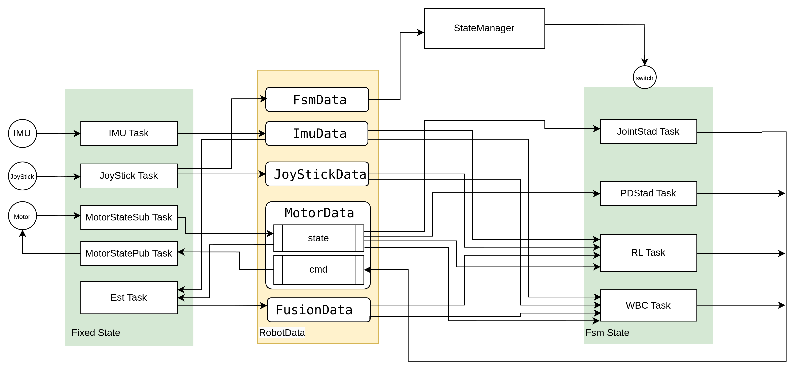

# Introduction

This is the introduction to the Fourier Aurora SDK, providing a general overview of the main concepts of Aurora.

It is very helpful for those who are new to Aurora and want to understand how it works. Besides, Aurora is a C++ based system, which requires some knowledge of C++ programming language to fully understand the code.

## What is Aurora?

Aurora is a motion control system designed for real-time control of humanoid robots. It plays an important role between the hardware and upper software layers of a robotic system. On one side, Aurora interacts with the hardware components, such as sensors and actuators, collecting data and sending commands to them. On the other side, Aurora utilizes a set of tools and libraries to create and execute motion control tasks. These tasks contain different whole-body controllers, tracking targets such as linear velocity for locomotion, cartesian space control for manipulation, and joint space control for motion planning.

Aurora provides a set of controllers for developers for high-level applications. Users can also create their own controllers follwing the Aurora programming interface.

## Centered Data Structure and Task-Based Programming

The key feature of Aurora is its centered data structure and task-based programming.

In the lifetime of Aurora, most parts are about task creation, excution and destruction. Each task is designed to perform a specific function, such as reading data from a sensor, processing data, and sending data to a device.

There are two kinds of tasks in Aurora: *Fixed task* and *FSM task*. Fixed tasks are created and destroyed atomatically during the lifetime of Aurora. They are designed to perform a fixed set of operations, such as reading data from a sensor, sending data to a device and publishing/subscribing data.

FSM tasks can be created and destroyed dynamically during the lifetime of Aurora. They are designed to perform a set of motion control operations based on a finite state machine. Users can create their own FSM tasks by defining a set of states and transitions, and then bind them to a specific controller.

A simplified view of the data flow in Aurora 

Data exchange among tasks is done through a shared data structure called *RobotData*. RobotData is a centralized data structure that is shared by all tasks in Aurora. It contains all the data that is needed by tasks to perform their operations.

For example, a Fixed task reads data from a sensor and update the corresponding field in RobotData. A FSM task reads the current state of the robot and updates the command field in RobotData. Then another Fixed task reads the command field and sends it to the device.

## Lifetime Management

The lifetime management of tasks is done through a state manager. In the initial phase, the state manager will execute the `init` and `enter` interface of a task. Then the `execute` funtion will be binded to a new thread, and the state manager will start the created thread, executing the `execute` function periodically. In the exiting phase, the state manager will execute the `exit` interface of a task and destroy the thread.

When Aurora program starts, it will first do a self-check to ensure that all the necessary hardware components are available. Then it will create and start the state manager, which will create and start all the Fixed tasks. After that, the state manager will enter the default FSM state with no FSM task running.

When switching to a new FSM state, the state manager will stop the current FSM task inclued in the current state and destroy the threads. Then it will initialize the new FSM tasks and create new threads to execute them according to the new state configuration.

Upon receiving the exit signal, Aurora will stop all the tasks, destroy all the threads, and disable the motors.
